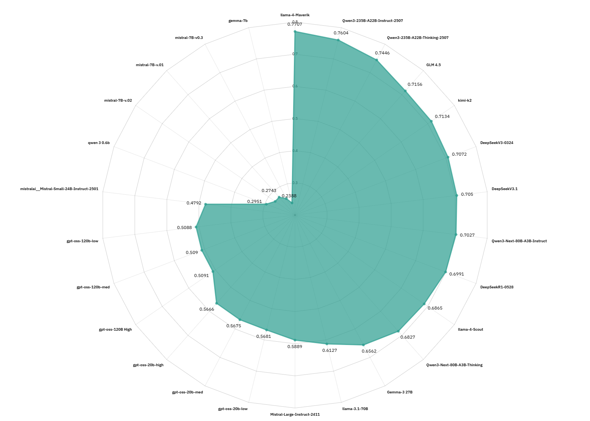

# Indic MMLU — Benchmarking Open-Source LLMs on Indian Languages

**Short description:**
A rigorously prepared, multi-language adaptation of the CAIS/MMLU test set, translated and enhanced for 16 Indic languages to evaluate open-source LLMs’ real-world understanding of Indian languages. This README explains *what* we built, *why* it matters, *how* it was produced, and *how* to reproduce the evaluation.

---

## Why this dataset exists (the purpose — stated clearly)

Large language models are frequently trained and benchmarked on English datasets. To fairly evaluate whether an open-source model genuinely understands an Indic language (and not just mirror English behavior), we translated the widely used CAIS/MMLU benchmark into Indian languages and improved translation quality with controlled enhancement steps.

A model whose score on an Indic version is close to its English MMLU score demonstrates *robust language understanding* (not just brittle translation or token mapping). This benchmark therefore helps:

* Measure cross-lingual generalization of LLMs.
* Identify language-specific weaknesses (math, domain knowledge, phrasing).
* Guide model development and fine-tuning for Indian languages.
* Provide a reproducible dataset and evaluation pipeline for the community.

---

## Overview

* **Source benchmark:** CAIS/MMLU (general knowledge QA benchmark).
* **Target:** 16 Indic languages + English (translated test set).
* **Workflow:** Machine translation → LLM-based translation enhancement → embedding comparison → human/linguist rating and automated evaluation.
* **Deliverables:** Enhanced translated `.jsonl` datasets, per-language embeddings, cosine similarity reports, teacher/linguist ratings, model evaluation scores and visualizations (radar plots, top-3 per language).

---

## Key principles applied

1. **Preserve semantic parity:** Questions remain semantically the same as English; only language changes.
2. **Quality control:** Automated checks (embeddings, math correctness) + human linguist ratings.
3. **Reproducibility:** Dockerized inference environment, scriptable pipeline, and clear CLI commands.
4. **Transparency:** We provide similarity metrics to demonstrate translation fidelity and teacher ratings to highlight linguistic quality.

---

## High-level pipeline (what we did)

1. **Translate** the CAIS/MMLU test set to each Indic language using *IndicTrans2* (baseline MT).
2. **Enhance** those translations using an open-source LLM with task-specific instructions (to correct phrasing, clarify ambiguous translations, preserve math expressions, and maintain answer choices alignment).
3. **Embed** both the original English items and the (enhanced) translated items with the same embedding model.
4. **Compare** embeddings using cosine similarity to measure semantic closeness.
5. **Human review**: linguists/teachers rated samples for language quality, math correctness, and coherence.
6. **Evaluate models**: run ~24 open-source LLMs across all languages using the lm-eval framework and visualize results (radar plots, top-3 per language).

---

## Pseudo-algorithm (concise)

```
For each language in target_languages:
  translated = translate(original_mmlu, tgt=language)
  enhanced = enhance_using_llm(translated, instructions)
  eng_emb = embed(original_mmlu)
  trans_emb = embed(enhanced)
  sim_scores = cosine_similarity(eng_emb, trans_emb)
  human_ratings = rate_sample(enhanced)
Aggregate results, compute per-language model scores, produce visualizations
```

---

## Reproducible commands (examples)

> These are the canonical commands used in our pipeline. Replace file paths, ports, and concurrency values as appropriate for your environment.

**Translate**

```bash
python3 trans_mmlu.py \
  --input_file_path test-00000-of-00001_with_ids.jsonl \
  --output_file_path mmlu_kn_in.jsonl \
  --tgt_lang "kn" \
  --src_lang "en"
```

**Enhance translations (LLM-based)**

```bash
python3 async_infr.py \
  --input-path mmlu_as_in.jsonl \
  --output-file ds_enhance_eval_hi.jsonl \
  --instruction-path instruction_prompts.yml \
  --task deepseek_enhance_instruct \
  --template-fields 'og_question' 'og_choices' 'question' 'answer' 'Hindi' \
  --max-concurrency 4096 \
  --backend sglang-oai-chat \
  --extra-request-body '{"temperature":0.7,"top_p":0.9,"top_k":50,"max_tokens":1024}' \
  --port 30000
```

**Generate embeddings**

```bash
python3 get_embeddings.py \
  --input-file test-00000-of-00001_with_ids.jsonl \
  --output-file mmlu_qwen3_embd.jsonl \
  --server-url http://127.0.0.1:30000 \
  --concurrency 4096
```

**Cosine similarity (English vs translated enhancements)**

```bash
python3 calculate_cosine_similarity.py \
  --input_dir deepseek_enhance \
  --output_dir mmmlu/similarity/cosine/enhance/deepseek_enhance \
  --english_file mmlu_eng.jsonl
```

**Linguist / teacher rating (LLM assisted orchestration)**

```bash
python3 async_infr.py \
  --input-path mmlu_as_in.jsonl \
  --output-file ds_enhance_eval_as_qwen3_instruct.jsonl \
  --instruction-path instruction_prompts.yml \
  --task rate_translated_text_linguist \
  --template-fields 'og_question' 'og_choices' 'enhanced_text' 'Assamese' \
  --max-concurrency 4096 \
  --backend sglang-oai-chat \
  --extra-request-body '{"temperature":0.7,"top_p":0.9,"top_k":50,"max_tokens":1024}' \
  --port 30000
```

**Model evaluation with `lm-eval`**

```bash
# Example wrapper which runs evaluation for a model snapshot against the Indic MMLU dataset
bash lm-eval-llm.sh /path/to/model_snapshot /benchmark-result-path
```

---

## Summary of human (teacher) ratings — interpretation

* **What we measured:** language quality, math correctness, coherence, and linguistic suitability.
* **How to read the table:** higher scores (closer to the upper bound used during rating) indicate better perceived translation/enhancement quality and correctness.
* **Notable:** Most languages show high average scores (>8.9) indicating strong quality after enhancement. A few languages display outlier lower ratings suggesting targeted improvement is still required.

* Ratings cover **language quality, math correctness, coherence, and linguistic aspects**.

| Language  | Avg Maths Rate | Avg Coherence Rate | Avg Linguist Rate | Total Records |
|-----------|----------------|--------------------|-------------------|---------------|
| Nepali    | 9.473793       | 9.331505           | 8.402293          | 14042         |
| Telugu    | 9.220837       | 8.975929           | 7.986256          | 14042         |
| Oriya     | 9.264421       | 8.944096           | 8.220268          | 14042         |
| Punjabi   | 9.348027       | 9.049138           | 8.253454          | 14042         |
| Assamese  | 9.147201       | 9.039097           | 8.133243          | 14042         |
| Sanskrit  | 8.338485       | 8.112520           | 6.390115          | 14042         |
| Kannada   | 9.322746       | 9.111736           | 8.131819          | 14042         |
| Sindhi    | 2.070645       | 3.109956           | 2.478137          | 14042         |
| Gujrati   | 9.260647       | 9.206523           | 8.368965          | 14042         |
| Marathi   | 9.301951       | 9.342045           | 8.381926          | 14042         |
| Tamil     | 9.047856       | 9.042943           | 8.071144          | 14042         |
| Malayalam | 9.134952       | 8.998148           | 7.956488          | 14042         |
| Maithili  | 9.263282       | 9.118146           | 8.218772          | 14042         |

---

## Cosine similarity — interpretation

* Cosine similarity gives a quick automated signal of semantic closeness between the translated/enhanced items and their English originals.
* Typical mean similarities range from ~0.76 to 0.85 across languages; higher means closer embeddings (better semantic preservation).
* Use the similarity scores as a triage: low similarity → manual review; high similarity → likely semantically faithful.

| Language               | Mean Similarity | Std Similarity | Min Similarity | Max Similarity |
|-------------------------|-----------------|----------------|----------------|----------------|
| mmlu_as_in_qwen3_embed  | 0.8045          | 0.0597         | 0.4644         | 1              |
| mmlu_bn_in_qwen3_embed  | 0.8133          | 0.0504         | 0.5276         | 1              |
| mmlu_gu_in_qwen3_embed  | 0.8211          | 0.0535         | 0.4016         | 1              |
| mmlu_hi_in_qwen3_embed  | 0.8472          | 0.0489         | 0.3688         | 1              |
| mmlu_kn_in_qwen3_embed  | 0.8106          | 0.0565         | 0.4660         | 1              |
| mmlu_mai_in_qwen3_embed | 0.8226          | 0.0504         | 0.4936         | 1              |
| mmlu_ml_in_qwen3_embed  | 0.8158          | 0.0531         | 0.5109         | 1              |
| mmlu_mr_in_qwen3_embed  | 0.8129          | 0.0513         | 0.5281         | 1              |
| mmlu_ne_in_qwen3_embed  | 0.8242          | 0.0502         | 0.4802         | 1              |
| mmlu_or_in_qwen3_embed  | 0.8159          | 0.0555         | 0.4684         | 1              |
| mmlu_pa_in_qwen3_embed  | 0.8246          | 0.0516         | 0.5450         | 1              |
| mmlu_sa_in_qwen3_embed  | 0.7912          | 0.0574         | 0.4981         | 1              |
| mmlu_sdd_in_qwen3_embed | 0.7646          | 0.0735         | 0.3633         | 0.9676         |
| mmlu_ta_in_qwen3_embed  | 0.7964          | 0.0559         | 0.5242         | 1              |
| mmlu_te_in_qwen3_embed  | 0.8006          | 0.0524         | 0.5379         | 1              |

---

## Model evaluation methodology (concise)

1. **Environment:** Docker image `vllm/vllm-openai:latest` to ensure a reproducible inference environment.
2. **Framework:** `lm-eval` for standardized metrics and consistent evaluation across models.
3. **Metrics:** per-language accuracy, top-k model rankings per language, and aggregate averages.
4. **Visualization:** radar plots per language on 26 opensource models.

### 📊 Indic MMLU Results 

|  |  |
|----------------------------------|--------------------------------|
|    |  |
|        |  |
|  |  |
|    |    |
|        |  |
|  |    |
|        |    |

---

## How to reproduce (quick checklist)

1. Prepare the English CAIS/MMLU test set (`.jsonl` with IDs).
2. Run `trans_mmlu.py` to produce per-language MT outputs.
3. Run `async_infr.py` with the enhancement task to obtain human-readable improved translations.
4. Generate embeddings for both English and enhanced translations.
5. Run `calculate_cosine_similarity.py` to produce similarity reports.
6. Optionally run human/linguist rating orchestration for additional quality assessment.
7. Evaluate models with `lm-eval` and generate visualizations.

---

## Best practices & caveats

* **Math and formatting:** preserve mathematical expressions and numerals during translation—these are critical for correctness.
* **Choice alignment:** ensure answer choices remain in the same order and map to the same ground-truth labels.
* **Human review:** automated metrics are helpful but not sufficient; include periodic linguist sampling.
* **Constrained inference:** use deterministic LLM settings for enhancement (lower temperature, consistent decoding) to reduce hallucination.

---

## Visual assets & tables

We include per-language radar plots and a consolidated results panel in `plots/`. The README in the repo contains thumbnails; click through for full-resolution visuals. If you want, I can add a two-column gallery layout for those images in the README for better presentation.

---

